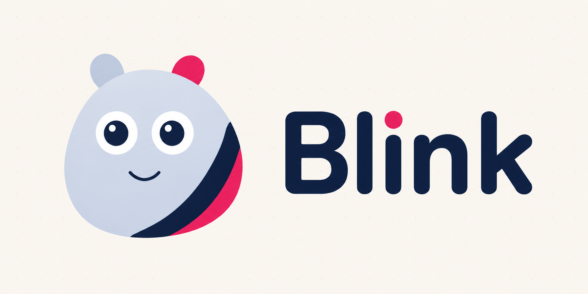

<p align="center">
  
</p>

# Blink

A desktop app (Tauri + Vue 3) for designing cute animated 2D character avatars and exporting each one as a self-contained Vue 3 component. No runtime dependencies, just SVG and CSS keyframes.

## How it works

The avatar is always front and centre, with tools in the sidebar on the right. The square buttons at the bottom of the sidebar switch between the two workspaces:

- **Pose** — build the character: one body shape (rounded rect, circle, ellipse, capsule, trapezoid, tapered, blob), decorative sub-shapes (drag from the palette under the canvas; move/resize/rotate with Figma-style handles, snapping, mirror pairs), a linked pair of eyes and a morphable mouth. Eyes and mouth are permanent, restyle them, don't delete them.
- **Expressions** — 12 presets (idle, happy, curious, angry, confused, sad, surprised, sleepy, love, laughing, wink, dizzy), each previewed and thumbnailed on your own avatar. Tune speed, intensity and loop mode per expression. Right-click a card to choose whether it ships in the export, or to save it as an animated GIF.

The idle blink (randomised-feeling 3-6s interval) and optional pupil drift are baked into every export.

Stuck for a design? The New dialog can build a copy-paste prompt for any AI chat (ChatGPT, Claude, ...) that returns a ready-to-import `.avatar` file.

## Running

```sh
npm install
npm run tauri dev     # desktop app
npm run dev           # browser-only dev (file dialogs fall back to download/upload)
```

## Building

```sh
npm run tauri build
```

## Project files

Save/load as JSON with the `.avatar` extension (File buttons in the top bar, ⌘S to save). Your working project autosaves in the app, so it's there when you reopen.

## Export

⌘E or the Export button:

1. **Single-file component** — `MyAvatar.vue` with inline SVG, scoped keyframe CSS, and props `expression` / `size` / `paused` plus an `animation-end` emit for play-once expressions.
2. **Multi-file bundle** — component + `expressions.ts` + README.
3. **SVG / PNG snapshot** of the current pose.

Animated GIFs export per expression from the right-click menu on the Expressions tab.

The editor preview, thumbnails and exported component all render from the same geometry and CSS generators, so the export matches the editor exactly. See `samples/BoxBuddy.vue` for a generated example (`npm run generate:sample` regenerates it).

## Keyboard

- ⌘Z / ⇧⌘Z — undo/redo (50 steps)
- Arrows / ⇧+arrows — nudge 1px / 10px
- ⇧ while resizing — keep aspect; ⌥ — resize from centre; ⇧ while rotating — 15° steps
- Space+drag / middle-drag — pan; ⌘+scroll or pinch — zoom
- Delete — remove selected shape
